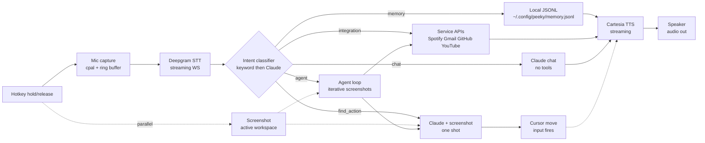

# Architecture

One voice turn end to end. Hot path: ~1.2s from hotkey release to action.

## Pipeline

Solid: data path. Dotted: pre-captured screenshot and optional TTS confirmation.

## Five intent paths

| Path | When it fires | Output |
| --- | --- | --- |
| `memory` | "remember my X is Y", "what's my Z" | Local store read/write |
| `find_action` | "where is X", "click X", "type X" | Cursor or input event |
| `integration` | "play X", "check my email", "show my PRs" | Service call + spoken summary |
| `chat` | "what's your name", "how does X work" | Spoken reply |
| `agent` | Multi-step chains | Iterative tool use |

Keyword classifier (`intent.rs`) handles ~80% of turns in <1ms. Ambiguous turns fall through to a Claude call (~700ms).

## Why this shape

- **Screenshot in parallel with STT.** ~60% of turns never need it; eager capture is cheaper than blocking `find_action` on it.
- **Keyword classifier first.** Skips the 700ms LLM round-trip when intent is obvious.
- **Per-turn TTS channel.** Sentences stream to Cartesia as Claude emits them. Knobs in `tuning.rs`.
- **Barge-in cancellation.** Hotkey re-fire cancels the in-flight turn. See `barge_in.rs`.

## Where each piece lives

| Module | Responsibility |
| --- | --- |
| `audio/` | Mic capture, ring buffer, RMS for the overlay |
| `providers/stt_deepgram` | Streaming STT over WS |
| `providers/claude` | Classifier, find_action, chat, agent |
| `providers/tts_cartesia` | Streaming TTS |
| `intent.rs` | Keyword classifier |
| `orchestrator.rs` | Per-turn state machine |
| `voice_session.rs` | Tokio runtime + shared state |
| `screenshot/` | Workspace capture, resize for Claude |
| `actions.rs` | Cursor move, click, key input |
| `barge_in.rs` | Cancel in-flight turn on hotkey re-fire |
| `tuning.rs` | Behavioral knobs with up/down tradeoff comments |
| `painter.rs` | Overlay rendering (layer-shell or winit) |

## Memory layer

JSONL key/value at `~/.config/peeky/memory.jsonl`. Three-tier design (FTS5 log, embeddings, sleep-time consolidation) in [memory-architecture.md](./memory-architecture.md).

## Next: lasso to ask

Hold the hotkey, drag the cursor to circle a region of the screen, ask a question.
The outline ships to the model alongside the transcript as literal context.
Pointing replaces describing, which solves referential ambiguity in voice agents.
